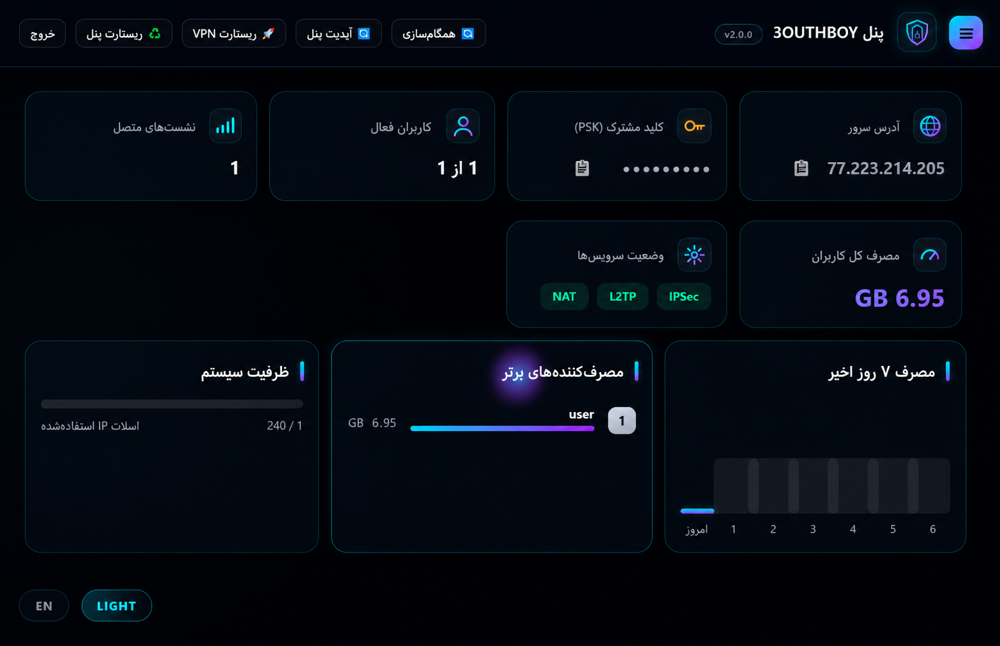
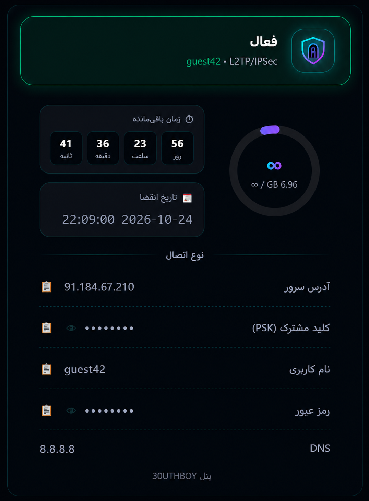

<div align="center">

<h1>
  
  3OUTHBOY PANEL
</h1>

**English** | [فارسی](README.fa.md)

L2TP/IPSec VPN server with a modern web management panel

[](https://ubuntu.com)
[](LICENSE)
[](#features)
[](#quick-install)

**Panel Dashboard** | **User Status Page**




</div>

---

## Table of Contents
- [Features](#features)
- [Quick Install](#quick-install)
- [Connecting Users](#connecting-users)
- [Panel Management](#panel-management)
- [System Architecture](#system-architecture)
- [Troubleshooting](#troubleshooting)
- [Uninstall](#uninstall)

---

## Features

### VPN Server
| Feature | Details |
|---------|---------|
| **L2TP/IPSec PSK** | Works with Windows, Android, iOS and macOS — no extra app needed |
| **strongSwan** | curve25519 + modp1024 proposals for maximum compatibility (incl. iOS 17+) |
| **192.168.43.x pool** | Up to 240 concurrent users |
| **XAuth (optional)** | Cisco IPsec config for legacy clients |
| **NAT + MSS Clamp** | Full internet access with optimized MTU |

### User Management
| Feature | Details |
|---------|---------|
| **Auto-expiry** | Exact date & time + automatic disconnection of expired users |
| **Traffic quota** | Custom GB limit per user + real-time traffic counting (30s updates) |
| **Custom DNS** | Per-user DNS (Shecan, Electro, 403...) with transparent redirect |
| **User key** | Personal status page per user — no login required |
| **Instant kick** | Password change or user deletion = immediate disconnect |

### Web Panel
| Feature | Details |
|---------|---------|
| **Bilingual** | Persian (RTL) / English (LTR) with one click |
| **Dark/Light theme** | Neon cyberpunk theme + minimal light theme |
| **Sidebar navigation** | Slide-out menu — Dashboard / Users / Settings |
| **Live dashboard** | 7-day traffic chart, top consumers, system capacity |
| **Settings page** | Change admin credentials, PSK, default DNS, panel port — all from the UI |
| **Backup download** | One-click full backup (users + settings) |
| **Self-update** | Update button syncs the latest version from GitHub in seconds |
| **Neon SVG icons** | Custom gradient icon set + glow cursor effect |

---

## Quick Install

### Interactive mode (recommended)

On your Ubuntu server, as root or with sudo:

```bash
bash <(curl -Ls https://raw.githubusercontent.com/3OUTHBOY/Panel-L2TP/main/install.sh)
```

The installer asks a few questions:
- Panel admin username and password
- **Panel port** (your choice, default 8080)
- PSK (default: secure auto-generated)
- Allowed admin IP for panel access (optional)
- Timezone and firewall

After ~2 minutes, connection info is displayed:

```
=====================================================
      3OUTHBOY PANEL — Installation complete!
=====================================================
 Panel URL       : http://YOUR_SERVER_IP:8080
 Admin username  : admin
 Admin password  : xK9mP2nQ8rT4
 IPSec PSK       : aB3cD4eF5gH6iJ7kL8mN
=====================================================
```

### Unattended mode (for automation & cloud-init)

```bash
bash <(curl -Ls https://raw.githubusercontent.com/3OUTHBOY/Panel-L2TP/main/install.sh) \
  --user admin \
  --pass MyStrongPass123 \
  --port 9443 \
  --psk MySecretPSK \
  --no-ufw
```

| Flag | Default | Description |
|------|---------|-------------|
| `--user` | `admin` | Admin username |
| `--pass` | random | Admin password |
| `--port` | `8080` | Panel port (user's choice) |
| `--psk` | random | IPSec pre-shared key |
| `--admin-ip` | empty | Allowed IP for panel (empty = no restriction) |
| `--no-ufw` | enabled | Skip UFW firewall setup |

> We use `bash <(curl ...)` instead of `curl | bash` so interactive prompts work correctly.

---

## Connecting Users

### Windows
1. **Settings → Network & Internet → VPN → Add a VPN connection**
2. VPN provider: `Windows (built-in)`
3. VPN type: **`L2TP/IPsec with pre-shared key`**
4. Pre-shared key: copy from panel
5. Username / Password: from panel

> If you get **error 809**: open UDP ports 500 and 4500 in Windows firewall and your router.

### Android
1. **Settings → Network & Internet → VPN → +**
2. Type: **`L2TP/IPSec PSK`**
3. Server address: server IP
4. IPSec pre-shared key: from panel
5. Username / Password: from panel

### iOS / macOS
1. **Settings → VPN → Add VPN Configuration**
2. Type: **`L2TP`**
3. Server: server IP
4. Account: username / Password: password
5. Secret: from panel

> iOS 17+ automatically negotiates curve25519/modp1024 proposals — no special settings needed.

### Linux (NetworkManager)

```bash
nmcli connection add type vpn vpn-type l2tp \
  con-name "MyVPN" vpn.data "gateway=SERVER_IP, ipsec-enabled=yes, ipsec-psk=YOUR_PSK" \
  vpn.secrets "username=USER, password=PASS"
```

---

## Panel Management

### Navigation

The panel uses a slide-out sidebar (hamburger button) with three sections: **Dashboard**, **Users** and **Settings**.

### Dashboard

- **Stat cards**: server address, PSK (show/copy), active users, sessions, total traffic
- **7-day traffic chart** with hover tooltips
- **Top consumers** leaderboard with gold/silver/bronze medals
- **System capacity** bar (IP slots used out of 240)
- **Service status**: IPSec / L2TP / NAT — green = running, red = problem

### Users

- **Add user**: username, password (blank = auto), validity (days), traffic limit (GB), DNS 1/2, exact expiry date
- **Users table**: reveal/copy password, expiry, remaining time, traffic bar, custom DNS, user key, status, actions

### Per-user actions

| Button | Action |
|--------|--------|
| **Renew + days** | Add days to user's expiry |
| **Edit** | Password, expiry, quota, DNS, user key |
| **Reset traffic** | Zero the usage counter |
| **New key** | New random key (old link becomes invalid) |
| **Delete** | Remove user + instant disconnect |

### User status link

Each user has a unique key — share this link:

```
http://SERVER_IP:PORT/u/USER_KEY
```

The user sees (no login): connection info, circular traffic gauge, **live countdown**, status.

> This link contains the VPN password — only share it with the user themself!

### Settings

All from the panel UI — no SSH needed:

| Setting | Action |
|---------|--------|
| **Admin account** | Change panel username & password |
| **PSK** | Change IPSec pre-shared key (auto-restarts IPSec) |
| **Default DNS** | Server-wide DNS for users without custom DNS |
| **Panel port** | Change web port (auto firewall + redirect) |
| **Backup** | One-click download of all users & settings |

### Quick actions (header)

- **Sync** / **Update Panel** (from GitHub, ~15s) / **Restart VPN** / **Restart Panel**

### Language & theme

- **FA / EN** chip: switch Persian ⇄ English
- **DARK / LIGHT** chip: switch theme (saved in browser)

### Recommended DNS servers

| Service | DNS 1 | DNS 2 |
|---------|-------|-------|
| Shecan | 178.22.122.100 | 185.51.200.2 |
| Electro | 78.157.42.100 | 78.157.42.101 |
| 403.online | 10.202.10.202 | 10.202.10.102 |
| Begzar | 185.55.226.26 | 185.55.225.25 |
| Google | 8.8.8.8 | 8.8.4.4 |
| Cloudflare | 1.1.1.1 | 1.0.0.1 |

---

## System Architecture

```
┌─────────────────────────────────────────────────┐
│                     Client                       │
│         (Windows / Android / iOS / Linux)        │
└───────────────────┬─────────────────────────────┘
                    │ UDP 500/4500 (IPSec) + 1701 (L2TP)
┌───────────────────▼─────────────────────────────┐
│                  strongSwan                      │
│         (IKEv1 PSK, transport mode)             │
└───────────────────┬─────────────────────────────┘
┌───────────────────▼─────────────────────────────┐
│                   xl2tpd  →  pppd                │
│      (CHAP auth, per-user DNS, counters)        │
└───────────────────┬─────────────────────────────┘
┌───────────────────▼─────────────────────────────┐
│              iptables NAT + DNS DNAT            │
└─────────────────────────────────────────────────┘

┌─────────────────────────────────────────────────┐
│        Web Panel (Flask + gunicorn + SQLite)     │
│                 panel/ in this repo              │
└─────────────────────────────────────────────────┘

┌─────────────────────────────────────────────────┐
│      sync_users.py (systemd timer, every 30s)    │
│   sync users · enforce expiry/quota · DNS rules  │
└─────────────────────────────────────────────────┘
```

### Files & paths

| Path | Description |
|------|-------------|
| `/opt/l2tp-panel/` | Panel main directory |
| `/opt/l2tp-panel/users.db` | SQLite users database (**back this up!**) |
| `/opt/l2tp-panel/config.json` | Config (admin password, PSK) |
| `/etc/ipsec.conf` | strongSwan config |
| `/etc/ppp/chap-secrets` | Active users (auto-managed) |
| `/run/l2tp-ifaces/` | Traffic counters |

### systemd services

```bash
systemctl status l2tp-panel          # web panel
systemctl status strongswan-starter  # IPSec
systemctl status xl2tpd              # L2TP
systemctl status l2tp-nat            # NAT
```

### Backup

From the panel: **Settings → Download backup** — or:

```bash
tar czf l2tp-backup-$(date +%F).tar.gz /opt/l2tp-panel/users.db /opt/l2tp-panel/config.json
```

---

## Troubleshooting

### Panel won't load

```bash
systemctl status l2tp-panel
journalctl -u l2tp-panel -n 30 --no-pager
```

### User can't connect

```bash
journalctl -u strongswan-starter -u xl2tpd -f
```

| Log message | Problem | Solution |
|-------------|---------|----------|
| Nothing appears | Firewall or ISP filtering | Open ports; test another carrier |
| `NO_PROPOSAL_CHOSEN` | Cipher mismatch | Open an issue |
| `Authentication failed` | Wrong credentials | Re-copy from panel |
| No internet | NAT problem | `systemctl restart l2tp-nat` |
| Error 809 (Windows) | Blocked ports | Open UDP 500/4500 |

### Traffic usage not showing

```bash
ls /run/l2tp-ifaces/
python3 /opt/l2tp-panel/sync_users.py
```

> Usage updates every ~30 seconds. Values under 1 GB are shown in MB.

### Custom DNS not working

User must **disconnect and reconnect**, then:

```bash
nslookup google.com
```

---

## Uninstall

```bash
systemctl disable --now l2tp-panel l2tp-sync.timer l2tp-sync l2tp-nat strongswan-starter xl2tpd
rm -f /etc/systemd/system/l2tp-{panel,nat,sync.service,sync.timer}
rm -rf /opt/l2tp-panel
rm -f /etc/ppp/ip-{up,down}.d/90l2tp-panel
rm -rf /etc/ppp/dns-map /run/l2tp-{sessions,ifaces,peerip}
rm -f /usr/local/sbin/l2tp-nat.sh
apt-get remove -y strongswan* xl2tpd gunicorn python3-flask
systemctl daemon-reload
```

---

## FAQ

**Are any passwords stored in the repo?**
No — admin password and PSK are randomly generated on each server during install.

**What happens if I run the script again?**
Configs get rewritten; the users database is preserved.

**How do I update the panel?**
Press **Update Panel** in the panel — pulls latest from this repo's `panel/` folder in ~15 seconds.

**How many concurrent users?**
Up to 240 (pool 192.168.43.10–250).

---

## License

MIT License — free to use, modify and distribute.

---

## Acknowledgements

- [strongSwan](https://www.strongswan.org/) — IPSec daemon
- [xl2tpd](https://github.com/xelerance/xl2tpd) — L2TP daemon
- [Flask](https://flask.palletsprojects.com/) — web framework
- [Vazirmatn](https://github.com/rastikerdar/vazirmatn) — Persian font

---

<div align="center">

**Built with ❤️ by [3OUTHBOY](https://github.com/3OUTHBOY)**

⭐ If you found this useful, give it a star!

</div>
